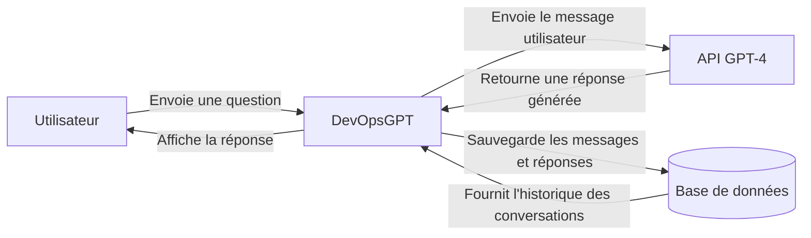

# Rendu - Evaluation finale DevOpsGPT

> Rendus principaux à ouvrir ou rendre :
>
> - Exercice 1 : `exercice 1/Exercice 1  Conception logicielle de DevOpsGPT.pdf`.
> - Exercice 2 : `exercice 2/Exercice 2 - Git et Docker DevOpsGPT.pdf`.
> - Exercice 3 : `exercice 3/Exercice 3 - CI-CD avec GitHub Actions DevOpsGPT.pdf`.
>
> Les fichiers HTML gardent le design source. Ce fichier Markdown garde les réponses texte en secours, au cas où le correcteur souhaite aussi une version lisible directement dans le dépôt.

## Exercice 1 : Conception logicielle

L'objectif de cet exercice est de représenter le fonctionnement global de l'application DevOpsGPT avant de parler de code, de Docker ou de CI/CD.

DevOpsGPT est une application de chat. Un utilisateur envoie une question depuis l'interface web. Le système vérifie d'abord si le message est acceptable, transmet ensuite le texte à une API d'intelligence artificielle, récupère une réponse, sauvegarde l'échange dans une base de données, puis affiche la réponse à l'utilisateur.

### 1. Diagramme de contexte

Le diagramme de contexte montre les acteurs et systèmes externes qui communiquent avec DevOpsGPT.



Explication :

| Élément | Rôle |
| --- | --- |
| Utilisateur | Personne qui utilise l'application pour poser des questions et lire les réponses. |
| DevOpsGPT | Système principal : il reçoit les messages, applique la modération, appelle l'API GPT-4 et affiche les réponses. |
| API GPT-4 | Service externe qui génère une réponse à partir du message envoyé par l'utilisateur. |
| Base de données | Stocke l'historique des conversations, les messages envoyés et les réponses générées. |

### 2. Organigramme / Flowchart

Ce flowchart décrit les étapes suivies lorsqu'un utilisateur envoie un message.

```mermaid
flowchart TD
    start([Début])
    receive[Réception du message utilisateur]
    validate{Le message est-il vide ?}
    empty[Afficher une erreur : message requis]
    moderate{Le message contient-il des insultes ?}
    rejected[Refuser le message et afficher une erreur de modération]
    sendApi[Envoyer le message à l'API GPT-4]
    receiveApi[Recevoir la réponse générée]
    saveDb[Sauvegarder le message et la réponse en base de données]
    display[Afficher la réponse à l'utilisateur]
    end([Fin])

    start --> receive
    receive --> validate
    validate -->|Oui| empty
    empty --> end
    validate -->|Non| moderate
    moderate -->|Oui| rejected
    rejected --> end
    moderate -->|Non| sendApi
    sendApi --> receiveApi
    receiveApi --> saveDb
    saveDb --> display
    display --> end
```

Explication des étapes :

| Étape | Description |
| --- | --- |
| Réception du message | Le backend reçoit le texte envoyé par l'utilisateur depuis l'interface web. |
| Vérification du message vide | Le système vérifie que l'utilisateur a bien saisi un contenu. |
| Filtre de modération | Le système vérifie si le message contient des insultes ou un contenu interdit. |
| Appel à l'API GPT-4 | Si le message est accepté, DevOpsGPT envoie le texte à l'API GPT-4. |
| Réception de la réponse | L'API retourne une réponse générée automatiquement. |
| Sauvegarde en base | Le message utilisateur et la réponse de l'assistant sont enregistrés dans l'historique. |
| Affichage | La réponse est renvoyée au frontend et affichée dans la conversation. |

### 3. Dictionnaire de données

Le dictionnaire de données liste les informations importantes à stocker pour un `Message`.

| Nom de la donnée | Type | Obligatoire | Description |
| --- | --- | --- | --- |
| id | UUID / String | Oui | Identifiant unique du message. |
| conversation_id | UUID / String | Oui | Identifiant de la conversation à laquelle le message appartient. |
| contenu | Text / String | Oui | Contenu du message envoyé par l'utilisateur ou généré par l'assistant. |
| role | String | Oui | Auteur du message : `utilisateur`, `assistant` ou `systeme`. |
| date_creation | DateTime | Oui | Date et heure de création du message. |
| statut_moderation | String | Oui | Indique si le message est `accepte`, `refuse` ou `a_verifier`. |
| modele_utilise | String | Non | Nom du modèle utilisé pour générer la réponse, par exemple `gpt-4`. |
| temps_reponse_ms | Integer | Non | Temps de réponse de l'API en millisecondes. |

Justification :

Ces attributs permettent de retrouver l'historique d'une conversation, de distinguer les messages de l'utilisateur et ceux de l'assistant, de tracer la modération, et de garder des informations techniques utiles pour le suivi de l'application.

---

## Exercice 2 : Git et Docker

L'objectif de cet exercice est de montrer la méthodologie Git à utiliser pour développer une fonctionnalité, puis de dockeriser l'application DevOpsGPT composée d'un frontend React/Vite, d'un backend Node.js/Express et d'un service Redis.

### 1. Méthodologie et Git

#### Question A : User Story

En tant qu'utilisateur de DevOpsGPT, je veux pouvoir souscrire à un abonnement Premium afin de bénéficier de fonctionnalités avancées, de limites d'utilisation plus élevées et d'un accès prioritaire au service.

#### Question B : Commandes Git

Créer une branche de fonctionnalité, préparer un commit et pousser la branche :

```bash
git checkout main
git pull origin main
git checkout -b feature-premium-subscription
git add .
git commit -m "Add premium subscription feature"
git push -u origin feature-premium-subscription
```

Une fois la fonctionnalité terminée et fusionnée sur `main`, créer le tag de version :

```bash
git checkout main
git pull origin main
git tag v1.0.0
git push origin v1.0.0
```

### 2. Dockerisation

Deux fichiers Dockerfile ont été créés :

- `backend/Dockerfile`
- `frontend/Dockerfile`

Le backend utilise l'image `node:22-alpine`, définit `/app` comme dossier de travail, installe les dépendances, expose le port `3000` et lance l'API avec `node index.js`.

Le frontend utilise aussi l'image `node:22-alpine`, définit `/app` comme dossier de travail, installe les dépendances, expose le port `5173` et lance l'application Vite avec `npm run dev`.

### 3. Orchestration avec Docker Compose

Le fichier `docker-compose.yml` a été créé à la racine du projet.

Il lance trois services :

| Service | Rôle | Build / Image | Port |
| --- | --- | --- | --- |
| `chat-api` | API backend Node.js / Express | `./backend` | `3000:3000` |
| `chat-ui` | Interface frontend React / Vite | `./frontend` | `5173:5173` |
| `cache` | Cache Redis | `redis:7-alpine` | `6379:6379` |

L'API communique avec Redis grâce à la variable d'environnement :

```yaml
REDIS_URL: redis://cache:6379
```

Le frontend communique avec l'API grâce au proxy Vite déjà configuré dans `frontend/vite.config.js` :

```js
target: 'http://chat-api:3000'
```

Commande de lancement :

```bash
docker compose up --build
```

Une fois les conteneurs lancés, l'application est accessible à l'adresse :

```text
http://localhost:5173
```

## Exercice 3 : CI/CD avec GitHub Actions

L'objectif de cet exercice est d'automatiser la vérification du code à chaque modification sur `main`, et de simuler un déploiement uniquement lorsqu'une nouvelle version est publiée avec un tag commençant par `v`.

### 1. Workflow CI/CD

Le fichier demandé a été créé ici :

```text
.github/workflows/main.yml
```

Contenu du workflow :

```yaml
name: CI/CD

on:
  push:
    branches:
      - main
    tags:
      - "v*"

jobs:
  test-and-deploy:
    runs-on: ubuntu-latest

    steps:
      - name: Recuperer le code
        uses: actions/checkout@v4

      - name: Installer Node.js
        uses: actions/setup-node@v4
        with:
          node-version: 22

      - name: Installer les dependances
        run: npm install

      - name: Lancer les tests
        run: npm test

      - name: Simuler le deploiement
        if: startsWith(github.ref, 'refs/tags/v')
        env:
          OPENAI_API_KEY: ${{ secrets.OPENAI_API_KEY }}
        run: echo "Déploiement en cours..."
```

Explication :

| Élément | Rôle |
| --- | --- |
| `on.push.branches: main` | Lance le workflow à chaque push sur la branche `main`. |
| `on.push.tags: "v*"` | Lance aussi le workflow lorsqu'un tag de version est poussé, par exemple `v1.0.0`. |
| `actions/checkout@v4` | Récupère le code du dépôt GitHub. |
| `actions/setup-node@v4` | Installe Node.js en version 22. |
| `npm install` | Installe les dépendances du projet. |
| `npm test` | Lance les tests ou la vérification du projet. |
| `if: startsWith(github.ref, 'refs/tags/v')` | Exécute le déploiement uniquement si l'événement GitHub concerne un tag commençant par `v`. |

### 2. Sécurité et Secrets

#### Question A : Où enregistrer le secret sur GitHub ?

Pour enregistrer la clé `OPENAI_API_KEY` de manière sécurisée, il faut aller dans le dépôt GitHub du projet, puis cliquer sur :

```text
Settings > Secrets and variables > Actions > New repository secret
```

Ensuite, il faut créer un secret avec :

| Champ | Valeur |
| --- | --- |
| Name | `OPENAI_API_KEY` |
| Secret | La clé API OpenAI |

Cette méthode évite d'écrire la clé directement dans le code source ou dans le fichier YAML.

#### Question B : Syntaxe pour injecter le secret dans le workflow

La syntaxe GitHub Actions est :

```yaml
env:
  OPENAI_API_KEY: ${{ secrets.OPENAI_API_KEY }}
```

Exemple dans l'étape de déploiement :

```yaml
- name: Simuler le deploiement
  if: startsWith(github.ref, 'refs/tags/v')
  env:
    OPENAI_API_KEY: ${{ secrets.OPENAI_API_KEY }}
  run: echo "Déploiement en cours..."
```
